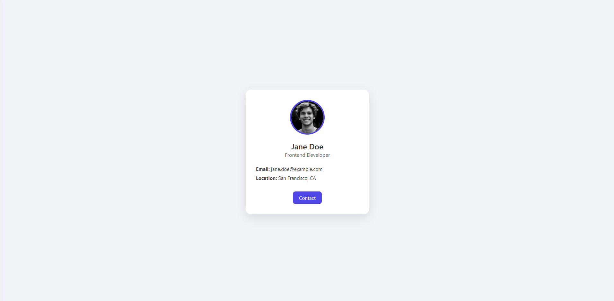
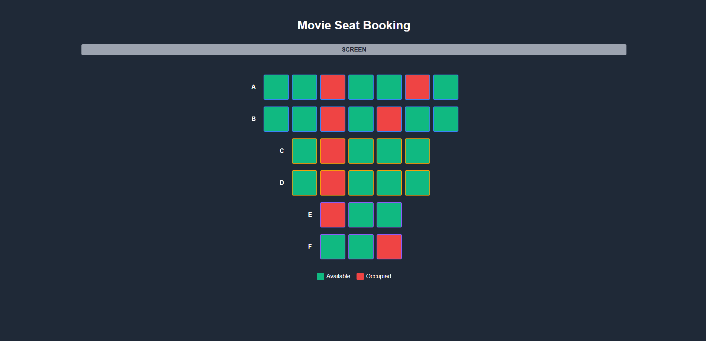
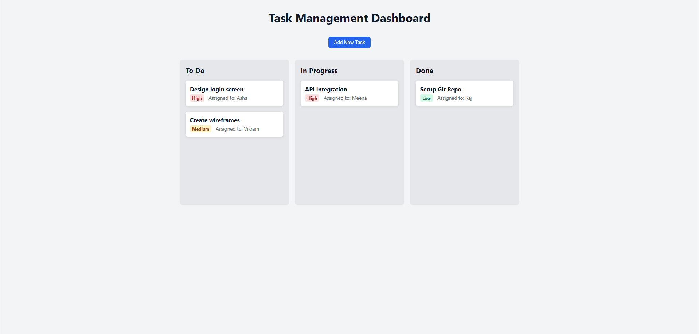

# 🎯 UI to React Component Conversion Challenge

Welcome to the **UI to React Component Conversion** challenge! This exercise is designed to help you practice breaking down static HTML/CSS UIs into reusable, maintainable React components.

You will be working with **three sample UIs**:
1. **User Profile Card**
2. **Movie Theatre Seating Page**
3. **Task Management Dashboard**

---

## ✅ Goal

Convert the given **HTML + CSS templates** into modern, clean **React components**. This will help you:
- Structure layouts with JSX
- Use props to pass data to child componenets
- Build reusable components
- Think in terms of composition and modularity

---

## 🗂️ Structure

Each project has a folder with:
- `index.html` (sample UI)
- `style.css`
- Screenshot of the final UI

Your goal is to replicate the design as a React app using modern practices.

---

## 🯩 Projects to Convert

### 1. 👤 User Profile Card

A simple profile card showing name, avatar, location, and bio.

**Screenshot**  


> React Components to create:
- `UserProfileCard`
- Optional: `Avatar`, `UserInfo`, `LocationTag`

---

### 2. 🎮 Movie Theatre Seat Selection

This page shows seats in a movie theatre, divided by pricing categories. Occupied and available seats are visually differentiated.

**Screenshot**  


> React Components to create:
- `TheatreLayout`
- `SeatRow`
- `Seat`
- Optional: `CategoryLegend`, `BookingSummary`

> Bonus:
- Use state to track selected seats
- Represent each category and seat with props

---

### 3. 📋 Task Management Dashboard

A dashboard to manage tasks grouped by status (To Do, In Progress, Done). Each task shows its priority and assignee.

**Screenshot**  


> React Components to create:
- `TaskBoard`
- `TaskColumn`
- `TaskCard`
- `AddTaskButton`

---

## 💡 Tips

- Start simple, and refactor into components.
- Use `props` to pass down data like `name`, `priority`, `seatType`, etc.
- Stick to function components
- Keep styling either inline, in CSS modules, or Tailwind (your choice).

---

## 📁 Folder Suggestion

```
react-ui-challenges/
│
├── user-profile/
│   ├── index.html
│   ├── styles.css
│   └── screenshot.png
│
├── movie-theatre/
│   ├── index.html
│   ├── styles.css
│   └── screenshot.png
│
├── task-dashboard/
│   ├── index.html
│   ├── styles.css
│   └── screenshot.png
│
├── README.md
└── /screenshots
```

---

## 🔚 Deliverables

- A React project for each UI with cleanly separated components
- Screenshots or screen recordings of your final results
- A README inside each React app explaining your approach (optional but recommended)

---

Happy coding! 🚀
